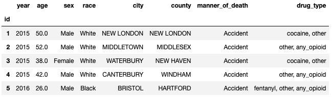
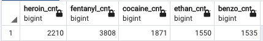
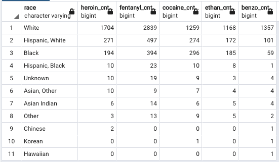

# ETL PROJECT

## Drug overdose deaths in Connecticut from 2012 to 2020

### Introduction

This project was done to analyze the drug overdose death in Connecticut, USA from 2012 to 2020. The purpose of this project was to build a database that helps  in analyzing the data like  death rate, population  based on  drug overdose death and census.
It also helped us analyze which the most abused drug amongst users and what race are subjected to drug abuse. 
The database is built on by ingesting, combining, and restructuring data from two main data sources into a conformed one PostgreSQL database. The two sources of our data are data.ct.gov for drug overdose data and [Census  API](https://www.census.gov/data/developers/data-sets.html) for scraping census data for different counties in Connecticut.

### Data Extraction

In this project we extracted, transformed, and loaded drug overdose death and census data for Connecticut, USA from 2012 to 2020.

Our main sources :

- [Drug overdose data from 2012 to 2020 ](https://data.ct.gov/Health-and-Human-Services/Accidental-Drug-Related-Deaths-2012-2020/rybz-nyjw)
- [Census Data from Census API](https://www.census.gov/data/developers/data-sets.html)

### Data Transformation

- We used  Pandas functions in Jupyter Notebook to transform all CSV files and API request responses.
- We reviewed the files and transformed into a dataframes.
- Filtered out unrelated columns.
- Divided a single column to two different columns. 
- Renamed column names to match database schema.
- Removed rows with Null/Nan values.
- Multiple rows were merged into single one to avoid duplicates.
- Set one column to index.
- We conducted some aggregation to find totals for comparison in the datasets.

### LOAD 

- For our final production, we used a relational database called Postgresql.
- We created a database called `drug_connecticut_db`.
- It has three tables census_ct , drug_master and drug_type.
- `drug_type` has 9 columns, `drug_master` has 13 columns and `census_ct` has 14 columns and the data loaded successfully. 
- Final tables/collections are stored in the production database.

### Final products

- Census table

- Drug table

- 

- Drug master table

- 

### Aggregate

- Total number of deaths from 2015 to 2020

- Total number of deaths per county

- Total number of deaths per race

- Total number of deaths per age

- Total number of deaths per sex

- Death rate per county

- Drug Usage between sex

- Most abused drug

- Drug users based on race

### Team member

- Tamasree Sinha
- Hima V
- Lekshmi Prabha
- Vilaysack Khonsavanh

